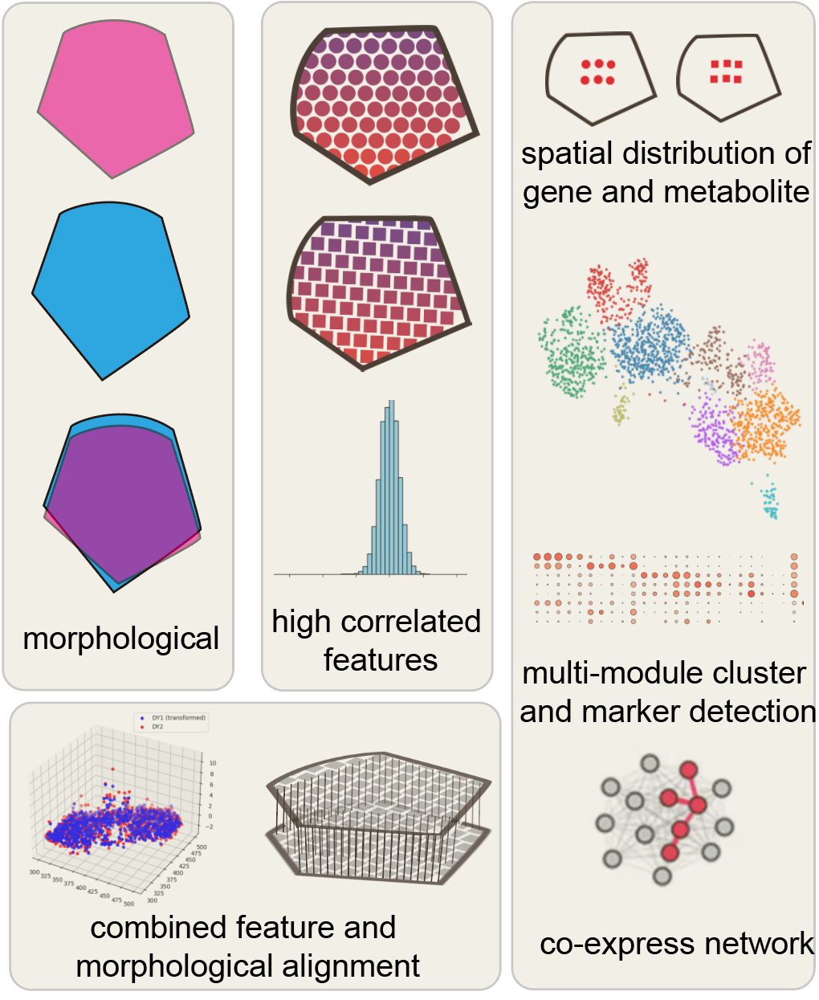

# **haCCA: Multi-module Integrating of spatial transcriptomes and metabolomes.**

haCCA, a workflow utilizing high Correlated feature pairs combined with a modified spatial morphological alignment to ensure high resolution and accuracy of spot-to-spot data integration of spatial transcriptomes and metabolomes.

[](https://badge.fury.io/py/haCCA)



## Installation

```python
pip install hacca
```

## Usage

```python
from hacca import *

a_h5ad = sc.read_h5ad(os.path.join('/path/to/a.h5ad'))
b_prime_h5ad = sc.read_h5ad(os.path.join('/path/to/b_prime.h5ad'))

# construct Data object from a and b_prime
# Data is a triplet of (X: np.ndarray, D: np.ndarray, Label: Optional[np.ndarray]), where X is the feature matrix, D is the spatial matrix that contains the location information, and Label is an optional array that contains the cluster information.

a = Data(X=a_h5ad.X.toarray(), D=a_h5ad.obsm['spatial'])
b_prime = Data(X=b_prime_h5ad.X.toarray(), D=b_prime_h5ad.obsm['spatial'])

# Infer b_predict from (a, b_prime) using the following alignment methods
# manual_gross_alignment | icp_3d_alignment | direct_alignment
# b_predict contains aligned feature from a and samples from b_prime

_b_prime = hacca.manual_gross_alignment(a, b_prime)
_a, _b_prime = hacca.icp_3d_alignment(a, _b_prime)
b_predict = hacca.direct_alignment(_a, _b_prime)
```

## Examples
You can refer to the [examples](./example) folder for more detailed usage.
